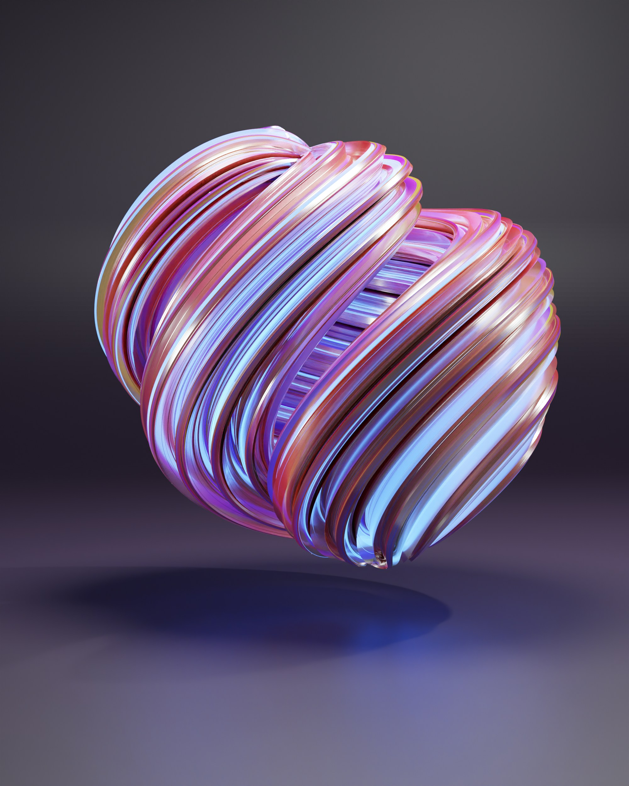

# Title of the document with H1


## Section with H2

Lorem ipsum dolor sit amet, consectetur adipiscing elit. Aenean a semper elit. Sed a pellentesque libero, a dictum diam. Duis sapien orci, scelerisque quis turpis sit amet, ultrices tempus arcu. Curabitur mi neque, consequat ut enim at, vestibulum rutrum nulla. In fringilla semper ligula, ac ullamcorper sem luctus volutpat. Vestibulum ante ipsum primis in faucibus orci luctus et ultrices posuere cubilia curae; Curabitur luctus egestas feugiat. Pellentesque accumsan nibh eu tellus molestie commodo. Etiam ullamcorper viverra mollis. Fusce pharetra sit amet magna eu volutpat. Nam gravida sem in porta posuere. In hac habitasse platea dictumst. Curabitur sit amet orci turpis. Nullam nulla odio, mattis sed mauris tempus, efficitur accumsan odio.

Praesent et nibh euismod, sagittis quam a, auctor turpis. Morbi vitae faucibus odio. Suspendisse quam felis, dignissim vitae aliquam a, viverra a neque. Donec auctor mollis mauris, vitae hendrerit enim accumsan dictum. Integer vulputate magna metus, eget auctor ante cursus non. Mauris lacinia non arcu sed imperdiet. Praesent blandit, felis sed congue lacinia, arcu dui euismod leo, congue imperdiet lorem eros ac leo. Morbi ut velit nec mi tempus pellentesque vel in massa. Nam feugiat elit at interdum tincidunt. Vestibulum lacus ligula, viverra sed lorem varius, porttitor blandit metus.

## Text

You can have **bold**, *italic*, and also [links](https://github.com/andreabonetti/md-doc).

## Tables

### Small table

| ID | Name    | Location |
| -- | ------- | -------- |
| 1  | Alice   | Zurich   |
| 2  | Bob     | Berlin   |
| 3  | Charlie | Paris    |


### Large Table

| ID  | First Name | Role       | Department     | Location | Active | Last Login       |
| --- | ---------- | ---------- | -------------- | -------- | ------ | ---------------- |
| 1   | Alice      | Engineer   | R&D            | Zurich   | Yes    | 2025-07-30 09:32 |
| 2   | Bob        | Designer   | UX             | Berlin   | No     | 2025-06-12 14:18 |
| 3   | Charlie    | PM         | Product        | Paris    | Yes    | 2025-07-29 08:45 |
| 4   | Dana       | Engineer   | R&D            | Zurich   | Yes    | 2025-07-31 12:01 |
| 5   | Ethan      | Analyst    | Strategy       | London   | No     | 2025-05-20 17:40 |
| 6   | Fiona      | HR Manager | People Ops     | Zurich   | Yes    | 2025-07-25 10:10 |
| 7   | George     | Legal      | Compliance     | Vienna   | Yes    | 2025-07-28 09:00 |
| 8   | Hannah     | Intern     | R&D            | Zurich   | No     | 2025-07-10 11:30 |
| 9   | Ian        | Engineer   | Infrastructure | Berlin   | Yes    | 2025-07-31 18:20 |
| 10  | Julia      | Data Lead  | AI             | Zurich   | Yes    | 2025-08-01 07:55 |

### Large table with long text

These are often badly rendered - need to figure out how to treat them.

| ID  | Model               | Brand  | Type | Body Wood      | Neck Wood    | Pickups                | Summary                                                                                                                                                                 |
| --- | ------------------- | ------ | ---- | -------------- | ------------ | ---------------------- | ----------------------------------------------------------------------------------------------------------------------------------------------------------------------- |
| 1   | Stratocaster        | Fender | SSS  | Alder          | Maple        | 3x Single-Coil         | The Fender Stratocaster is a Swiss army knife of guitars. Its chimey single-coils and ergonomic body make it a staple for versatile players across genres.              |
| 2   | Les Paul Standard   | Gibson | HH   | Mahogany+Maple | Mahogany     | 2x Humbucker           | The Gibson Les Paul offers raw power and singing sustain. Ideal for high-gain tones and expressive solos, though its heft and price tag are not for the faint of heart. |
| 3   | Telecaster          | Fender | SS   | Ash or Alder   | Maple        | 2x Single-Coil         | The Telecaster delivers honest, cutting tones that punch through the mix. It's a workhorse for rhythm players and a minimalist’s dream.                                 |


## Pictures

With caption (centered by default by pandoc)

{width=100px}

Without caption (it is not centered by pandoc):

{width=150px}

Photo by [Nikhil Dafare](https://unsplash.com/@designingsucks?utm_content=creditCopyText&utm_medium=referral&utm_source=unsplash) on [Unplash](https://unsplash.com/photos/a-close-up-of-a-colorful-ball-idVUh309DvA?utm_content=creditCopyText&utm_medium=referral&utm_source=unsplash).

## Code

Here you have some code:
```python
def compute_magic_value(data):
    # Initialize accumulator
    result = 0
    for item in data:
        if item % 2 == 0:
            result += item * 42
        else:
            result -= item // 3
    return result
```